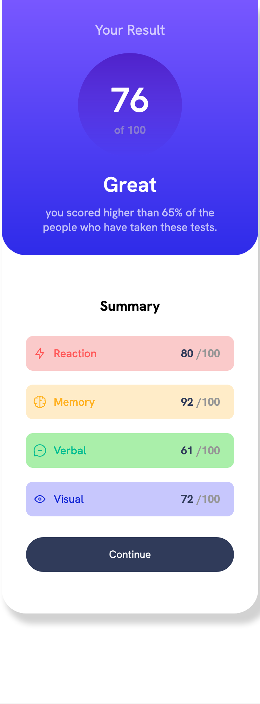

# Frontend Mentor - Results summary component solution

This is a solution to the [Results summary component challenge on Frontend Mentor](https://www.frontendmentor.io/challenges/results-summary-component-CE_K6s0maV). Frontend Mentor challenges help you improve your coding skills by building realistic projects. 

## Table of contents

- [Overview](#overview)
  - [The challenge](#the-challenge)
  - [Screenshot](#screenshot)
- [My process](#my-process)
  - [Built with](#built-with)
  - [What I learned](#what-i-learned)
  - [Continued development](#continued-development)


## Overview

### The challenge

Users should be able to:

- View the optimal layout for the interface depending on their device's screen size
- See hover and focus states for all interactive elements on the page

### Screenshot

 |


## My process

### Built with

- Semantic HTML5 markup
- CSS custom properties

### What I learned


In HTML, I discovered how the <span> element can seamlessly align inline with other elements and how it's adaptable for styling using CSS or JavaScript.

Furthermore, I gained knowledge about how the flex-direction property can modify the flow direction of elements, such as arranging them in a column or row layout.

Moreover, I explored the versatility of linear-gradient, discovering its ability to blend multiple colors seamlessly. It fascinated me to learn how the flow of colors within the gradient can be precisely adjusted by specifying degrees.


```html
<li class="reaction"> <svg xmlns="http://www.w3.org/2000/svg" width="20" height="20" fill="none" viewBox="0 0 20 20"><path stroke="#F55" stroke-linecap="round" stroke-linejoin="round" stroke-width="1.25" d="M10.833 8.333V2.5l-6.666 9.167h5V17.5l6.666-9.167h-5Z"/></svg> <p>Reaction </p> <span><div class="each-rate">80 </div> /100</span></li>
```
```css

.left-side {
    display: flex;
    flex-direction: column;
    flex: 1;
    background: linear-gradient(180deg,hsl(252, 100%, 67%),hsl(241, 81%, 54%));
    border-radius: 35px;
    padding: 20px;
    color: white;
    text-align: center;
    
}

.right-side { 
    display: flex;
    flex-direction: column;
    flex: 1;
    padding: 30px;
}

```

### Continued development

I aim to develop tests for each section and calculate the average user score. Furthermore, I plan to enhance the application's dynamism by utilizing JavaScript.


